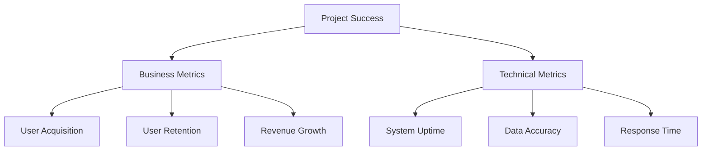
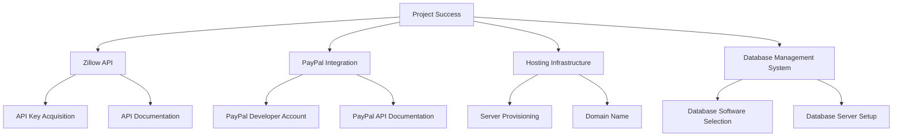
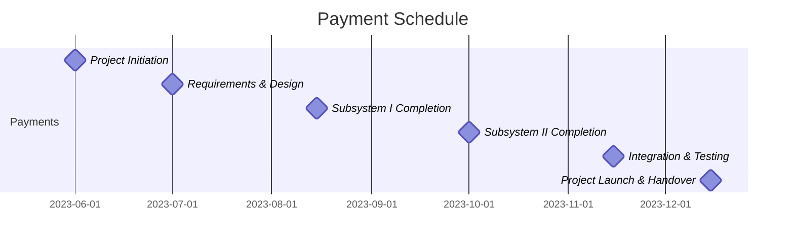
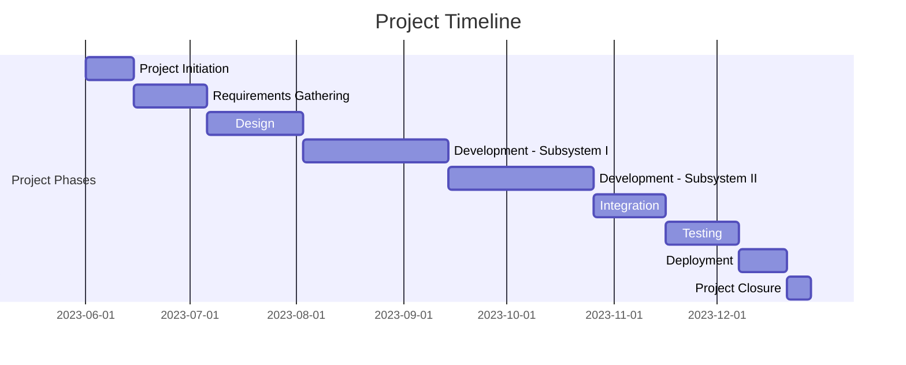
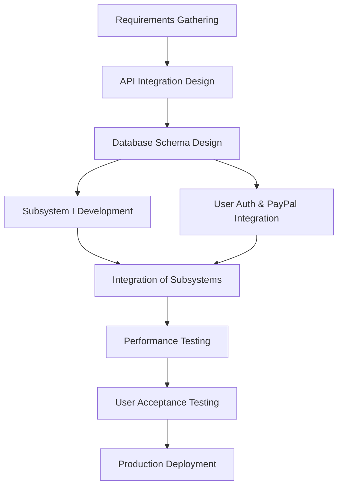
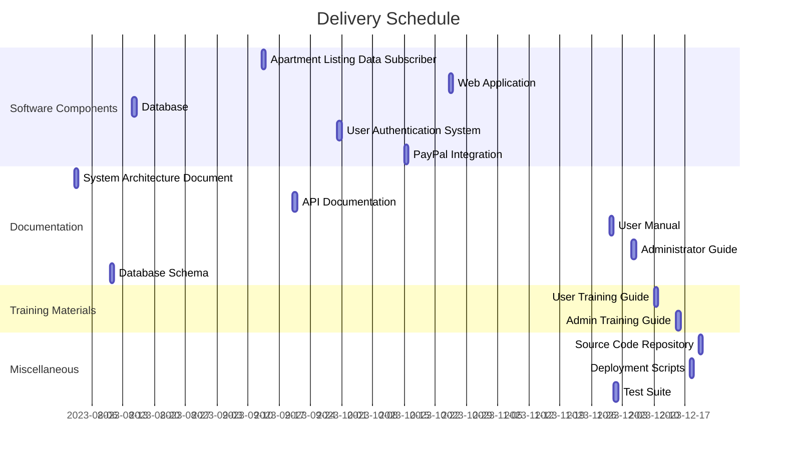

## EXECUTIVE SUMMARY

### PROJECT OVERVIEW

This project aims to develop a web service that assists recent college graduates in finding suitable apartments for rent. The solution addresses the challenges faced by young professionals in navigating the competitive rental market by providing a streamlined, user-friendly platform. The proposed system consists of two main components:

1. An apartment listing data subscriber that collects real-time rental information from Zillow's API.
2. A web application that allows users to create custom filters and view tailored apartment listings.

### OBJECTIVES

| Objective | Description | Benefit to Client |
|-----------|-------------|-------------------|
| Real-time Data Collection | Implement a service to subscribe to Zillow's API and collect up-to-date apartment listings | Ensures users have access to the most current rental information |
| Customized Filtering | Develop a web application allowing users to create and save personalized filters | Enables users to efficiently find apartments matching their specific criteria |
| User-friendly Interface | Design an intuitive table-based display of filtered listings | Improves user experience and simplifies the apartment search process |
| Secure User Management | Implement user authentication and subscription-based access | Provides a reliable revenue stream and ensures data privacy |
| Payment Integration | Incorporate PayPal for subscription payments | Offers a familiar and secure payment method for users |

### VALUE PROPOSITION

Our agency offers a unique combination of technical expertise and market understanding to deliver a comprehensive solution for recent college graduates seeking rental apartments. Key advantages include:

1. Seamless integration with Zillow's API, ensuring access to a wide range of up-to-date listings
2. A user-centric design focused on the specific needs of young professionals
3. Robust data management and filtering capabilities to streamline the apartment search process
4. Secure user authentication and payment processing through trusted platforms
5. Scalable architecture to accommodate future growth and additional markets
6. Expertise in both real-time data processing and web application development

By leveraging our technical skills and industry knowledge, we will create a valuable tool that simplifies the apartment hunting experience for recent graduates, while providing a sustainable business model for our client.

## PROJECT OBJECTIVES

### BUSINESS GOALS

1. Increase Revenue:
   - Establish a subscription-based model for apartment seekers
   - Target recent college graduates entering the rental market
   - Expand to multiple metropolitan areas to increase user base

2. Improve User Experience:
   - Simplify the apartment search process for young professionals
   - Provide real-time, accurate rental information
   - Offer personalized filtering options to match user preferences

3. Gain Market Share:
   - Become the go-to platform for recent graduates seeking apartments
   - Differentiate from competitors by focusing on user-specific needs
   - Build brand recognition and loyalty among the target demographic

4. Enhance Data Accuracy:
   - Ensure up-to-date and reliable apartment listings
   - Minimize discrepancies between listed and actual rental information

### TECHNICAL GOALS

1. Zillow API Integration:
   - Develop a robust data subscriber service to collect real-time apartment listings
   - Implement efficient data extraction and storage processes

2. Database Management:
   - Design and implement a scalable relational database structure
   - Optimize indexing for quick and efficient data retrieval

3. Web Application Development:
   - Create a user-friendly interface for filter creation and listing display
   - Implement secure user authentication and management systems

4. Payment Integration:
   - Seamlessly incorporate PayPal for subscription payments
   - Ensure secure and compliant financial transactions

5. Performance Optimization:
   - Achieve fast loading times for listing displays (target: < 2 seconds)
   - Handle concurrent users efficiently (target: support 1000+ simultaneous users)

6. Scalability:
   - Design the system architecture to easily accommodate new markets and increased user load
   - Implement modular code structure for future feature additions

### SUCCESS CRITERIA

| Criteria | Description | Target |
|----------|-------------|--------|
| User Acquisition | Number of new subscribers within the first 6 months | 10,000 |
| User Retention | Percentage of users renewing their subscription after the first month | 70% |
| System Uptime | Percentage of time the service is available and functioning correctly | 99.9% |
| Data Accuracy | Percentage of listings with correct and up-to-date information | 98% |
| User Satisfaction | Average rating from user feedback surveys (scale 1-5) | 4.5 |
| Response Time | Average time to display filtered listings | < 1 second |
| Conversion Rate | Percentage of free trial users converting to paid subscribers | 30% |
| Revenue Growth | Month-over-month increase in subscription revenue | 15% |

This mermaid diagram illustrates the key success criteria categories and their relationship to overall project success.

## SCOPE OF WORK

### IN-SCOPE

1. Apartment Listing Data Subscriber (Subsystem I)
   - Development of a service to subscribe to Zillow's API for real-time apartment listings
   - Implementation of data extraction for specified fields:
     - Date on market
     - Rent
     - Broker fee
     - Square footage
     - Number of bedrooms
     - Number of bathrooms
     - Available date
     - Street address
     - URL to Zillow.com listing
   - Design and implementation of a relational database to store extracted data
   - Indexing of all collected data fields for efficient retrieval

2. Web Application (Subsystem II)
   - User authentication system (sign up and sign in functionality)
   - Custom filter creation interface allowing users to specify:
     - Up to 5 zip codes
     - One simple criteria involving a listing data field
   - Development of a table-based interface to display filtered listings
   - Implementation of sorting functionality (descending order by listing date)
   - Integration of clickable rows to open Zillow listing pages in new tabs
   - PayPal integration for subscription-based payment collection

3. System Integration
   - Connection between the data subscriber service and the web application
   - Implementation of database queries to retrieve filtered listings

4. Security Measures
   - Secure storage of user credentials
   - Implementation of HTTPS for all web traffic
   - Secure handling of PayPal transactions

5. Performance Optimization
   - Database query optimization for fast listing retrieval
   - Implementation of caching mechanisms where appropriate

6. Basic Reporting
   - User signup and subscription tracking
   - Basic usage statistics (e.g., number of active filters, frequently searched zip codes)

### OUT-OF-SCOPE

1. Mobile Application Development
   - The project will focus on a web-based solution only

2. Advanced Analytics
   - Complex data analysis or predictive modeling of rental trends

3. Direct Communication with Property Owners/Managers
   - The system will not facilitate direct messaging or appointment scheduling

4. Integration with Other Real Estate Platforms
   - The system will exclusively use Zillow's API

5. Automated Billing System
   - Recurring payments will be handled through PayPal's standard subscription features

6. Multi-language Support
   - The initial release will be in English only

7. Advanced Filter Criteria
   - Complex or multiple criteria beyond the specified single simple criterion

8. User Reviews or Ratings
   - The system will not include functionality for users to rate or review properties

### ASSUMPTIONS

1. Zillow API Availability and Stability
   - Zillow's API will remain available and stable throughout the project development and operation
   - API documentation is comprehensive and up-to-date

2. PayPal Integration
   - PayPal's API and services will be compatible with our system requirements
   - PayPal will support the subscription model we intend to implement

3. User Base
   - There is sufficient demand among recent college graduates for this service
   - Users have access to devices capable of accessing web applications

4. Legal Compliance
   - Use of Zillow's data in this manner complies with their terms of service and applicable laws
   - The client has obtained necessary permissions or licenses to use Zillow's API for commercial purposes

5. Technical Infrastructure
   - The client will provide or fund the necessary hosting infrastructure for the web application and database

6. Market Coverage
   - Zillow's API provides comprehensive coverage for the selected markets (e.g., greater Boston area)

### DEPENDENCIES

1. Zillow API
   - Acquisition of API key and necessary credentials
   - Adherence to Zillow's API usage terms and rate limits

2. PayPal Integration
   - Creation of a PayPal developer account
   - Approval for use of PayPal's subscription payment features

3. Hosting Infrastructure
   - Selection and setup of appropriate cloud hosting service
   - Configuration of web servers and database servers

4. Database Management System
   - Selection and licensing of a suitable relational database system
   - Setup and configuration of the database environment

5. SSL Certificate
   - Acquisition and installation of SSL certificate for secure HTTPS connections

6. Development Tools and Frameworks
   - Selection and setup of development environments
   - Acquisition of necessary software licenses

7. Third-party Libraries
   - Identification and integration of required third-party libraries or frameworks

8. Legal and Compliance
   - Verification of compliance with data protection regulations (e.g., GDPR if applicable)
   - Review and approval of terms of service and privacy policy

## BUDGET AND COST ESTIMATES

### COST BREAKDOWN

The following table provides a detailed breakdown of the estimated project costs:

| Category | Item | Quantity | Unit Cost | Total Cost |
|----------|------|----------|-----------|------------|
| Labor | Senior Full-Stack Developer | 600 hours | $150/hour | $90,000 |
| Labor | Junior Developer | 400 hours | $80/hour | $32,000 |
| Labor | UI/UX Designer | 160 hours | $120/hour | $19,200 |
| Labor | Project Manager | 200 hours | $130/hour | $26,000 |
| Labor | QA Tester | 160 hours | $90/hour | $14,400 |
| Software | Zillow API Access | 1 year | $5,000/year | $5,000 |
| Software | Database Management System | 1 license | $3,000 | $3,000 |
| Software | Development Tools and IDEs | 5 licenses | $500/license | $2,500 |
| Infrastructure | Cloud Hosting (Development) | 6 months | $500/month | $3,000 |
| Infrastructure | Cloud Hosting (Production) | 1 year | $1,000/month | $12,000 |
| Infrastructure | SSL Certificate | 1 year | $300/year | $300 |
| Miscellaneous | Legal and Compliance Review | 1 | $5,000 | $5,000 |
| Miscellaneous | Contingency Fund (10%) | 1 | $21,240 | $21,240 |

**Total Estimated Project Cost: $233,640**

### PAYMENT SCHEDULE

The proposed payment schedule is tied to project milestones and deliverables:

1. Project Initiation (10%): $23,364
   - Due upon contract signing

2. Requirements Gathering and Design Phase Completion (20%): $46,728
   - Due upon approval of detailed project specifications and UI/UX designs

3. Development Milestone 1 - Subsystem I Completion (20%): $46,728
   - Due upon successful implementation and testing of the apartment listing data subscriber

4. Development Milestone 2 - Subsystem II Completion (20%): $46,728
   - Due upon successful implementation and testing of the web application core features

5. Integration and Testing Phase Completion (15%): $35,046
   - Due upon successful integration of both subsystems and completion of comprehensive testing

6. Project Launch and Handover (15%): $35,046
   - Due upon successful deployment to production and completion of knowledge transfer

### BUDGET CONSIDERATIONS

Several factors could potentially impact the budget, and we have identified strategies to manage these risks:

1. Zillow API Integration Complexity
   - Risk: Unforeseen complexities in integrating with Zillow's API could increase development time.
   - Mitigation: We have allocated additional hours in the labor costs and included a contingency fund to account for potential challenges.

2. Scalability Requirements
   - Risk: As the user base grows, infrastructure costs may increase more rapidly than anticipated.
   - Mitigation: We have chosen a cloud hosting solution that allows for flexible scaling. We will monitor usage closely and adjust the infrastructure budget if needed.

3. Regulatory Compliance
   - Risk: Changes in data protection laws or Zillow's terms of service may require additional development or legal review.
   - Mitigation: We have included a budget for legal and compliance review and will stay informed about any regulatory changes that may affect the project.

4. PayPal Integration Challenges
   - Risk: Implementing PayPal's subscription model may be more complex than anticipated.
   - Mitigation: We have allocated sufficient development hours for this task and will consult with PayPal's developer support if needed.

5. Scope Creep
   - Risk: Client requests for additional features may impact the budget and timeline.
   - Mitigation: We have clearly defined the project scope and will use a change request process for any additions, with associated cost estimates.

6. Exchange Rate Fluctuations
   - Risk: If any project components involve international transactions, exchange rate changes could affect costs.
   - Mitigation: We will use forward contracts or set aside a small buffer in the contingency fund to account for potential currency fluctuations.

7. Third-Party Service Price Changes
   - Risk: Increases in the cost of third-party services (e.g., Zillow API, cloud hosting) could impact ongoing operational costs.
   - Mitigation: We will review all service agreements for potential price change clauses and factor these into our long-term budget projections.

By carefully managing these budget considerations and maintaining open communication with the client, we aim to deliver the project within the estimated budget while allowing for flexibility to address unforeseen challenges.

## TIMELINE AND MILESTONES

### PROJECT TIMELINE

The project is estimated to take approximately 6 months from initiation to completion. The following timeline outlines the major phases of the project:

### KEY MILESTONES

| Milestone | Description | Estimated Date |
|-----------|-------------|----------------|
| M1: Project Kickoff | Project charter approved, team assembled | 2023-06-01 |
| M2: Requirements Finalized | Detailed requirements document signed off | 2023-07-05 |
| M3: Design Approval | UI/UX designs and system architecture approved | 2023-08-02 |
| M4: Subsystem I Complete | Apartment listing data subscriber developed and tested | 2023-09-13 |
| M5: Subsystem II Complete | Web application core features developed and tested | 2023-10-25 |
| M6: Integration Complete | Both subsystems integrated and functioning | 2023-11-15 |
| M7: User Acceptance Testing | UAT completed and sign-off received | 2023-12-06 |
| M8: Go-Live | System deployed to production environment | 2023-12-20 |
| M9: Project Closure | Final documentation delivered, project retrospective completed | 2023-12-27 |

### CRITICAL PATH

The following tasks represent the critical path for the project. Any delays in these tasks will directly impact the project timeline:

1. Requirements Gathering and Analysis
   - Crucial for defining the scope and functionality of both subsystems

2. Zillow API Integration Design
   - Essential for Subsystem I and affects the entire data flow of the project

3. Database Schema Design
   - Critical for both subsystems and impacts overall system performance

4. Development of Subsystem I (Apartment Listing Data Subscriber)
   - Must be completed before integration can begin

5. User Authentication and PayPal Integration
   - Key components of Subsystem II that affect user access and revenue generation

6. Integration of Subsystems I and II
   - Critical for ensuring data flow between the data subscriber and web application

7. Performance Testing and Optimization
   - Essential for ensuring the system can handle expected user load

8. User Acceptance Testing
   - Final validation of the system's functionality and usability

9. Production Deployment
   - The final step in making the system available to end-users

To maintain the project schedule, close attention must be paid to these critical path items. Regular status updates and proactive risk management will be essential to address any potential delays or issues that may arise during the development process.

## DELIVERABLES

### LIST OF DELIVERABLES

| Category | Deliverable | Description |
|----------|-------------|-------------|
| Software Components | Apartment Listing Data Subscriber | Service that subscribes to Zillow's API and stores listing data |
| Software Components | Web Application | User interface for filter creation and listing display |
| Software Components | Database | Relational database storing apartment listings and user data |
| Software Components | User Authentication System | Secure login and registration functionality |
| Software Components | PayPal Integration | Payment processing for user subscriptions |
| Documentation | System Architecture Document | Detailed description of system components and their interactions |
| Documentation | API Documentation | Documentation for internal APIs and Zillow API integration |
| Documentation | User Manual | Guide for end-users on how to use the web application |
| Documentation | Administrator Guide | Instructions for system maintenance and management |
| Documentation | Database Schema | Detailed description of the database structure and relationships |
| Training Materials | User Training Guide | Step-by-step instructions for new users |
| Training Materials | Admin Training Guide | Instructions for system administrators |
| Miscellaneous | Source Code Repository | Version-controlled repository containing all project source code |
| Miscellaneous | Deployment Scripts | Scripts for automating the deployment process |
| Miscellaneous | Test Suite | Comprehensive set of unit, integration, and end-to-end tests |

### DELIVERY SCHEDULE

### ACCEPTANCE CRITERIA

| Deliverable | Acceptance Criteria |
|-------------|---------------------|
| Apartment Listing Data Subscriber | - Successfully connects to Zillow API - Extracts all required data fields - Stores data in the relational database - Handles API rate limits and errors gracefully - Processes at least 1000 listings per hour |
| Web Application | - Allows user registration and login - Enables creation and saving of custom filters - Displays filtered listings in a sortable table - Opens Zillow listing pages when rows are clicked - Integrates with PayPal for subscription payments - Loads listings in under 2 seconds |
| Database | - Implements the approved schema design - Supports concurrent read/write operations - Achieves query response times under 100ms for typical filters - Successfully stores and retrieves all required data fields |
| User Authentication System | - Securely stores user credentials - Implements password hashing and salting - Provides password reset functionality - Prevents common security vulnerabilities (e.g., SQL injection, XSS) |
| PayPal Integration | - Successfully processes subscription payments - Handles various payment scenarios (success, failure, cancellation) - Provides clear feedback on payment status to users - Complies with PCI DSS requirements |
| System Architecture Document | - Clearly describes all system components and their interactions - Includes diagrams for system architecture and data flow - Provides rationale for key architectural decisions - Reviewed and approved by the technical lead |
| API Documentation | - Covers all internal APIs and Zillow API integration - Includes request/response formats and examples - Describes error handling and rate limiting - Follows OpenAPI (Swagger) specification |
| User Manual | - Covers all user-facing features of the web application - Includes step-by-step instructions with screenshots - Written in clear, non-technical language - Reviewed for clarity by a non-technical reader |
| Administrator Guide | - Covers system setup, configuration, and maintenance tasks - Includes troubleshooting steps for common issues - Describes backup and recovery procedures - Reviewed and validated by a system administrator |
| Database Schema | - Accurately represents the implemented database structure - Includes entity-relationship diagrams - Describes all tables, columns, and relationships - Reviewed and approved by the database architect |
| User Training Guide | - Covers all key user workflows - Includes practical exercises for hands-on learning - Provides tips for effective use of the system - Reviewed for completeness by a test user group |
| Admin Training Guide | - Covers all administrative tasks and system management procedures - Includes scenarios for common administrative activities - Provides best practices for system optimization - Reviewed and validated by the operations team |
| Source Code Repository | - Contains all project source code with appropriate commit history - Includes README files for setup and contribution guidelines - Follows agreed-upon coding standards and conventions - Passes all automated code quality checks |
| Deployment Scripts | - Successfully deploys the entire system to the production environment - Includes rollback procedures - Handles environment-specific configurations - Tested in a staging environment before acceptance |
| Test Suite | - Achieves at least 80% code coverage - Includes unit, integration, and end-to-end tests - All tests pass in the CI/CD pipeline - Includes performance and load tests for critical components |

These acceptance criteria will be used to evaluate each deliverable before it is considered complete and ready for client approval. The project manager will work closely with the client to ensure that all criteria are met and that the deliverables align with the project objectives and requirements.