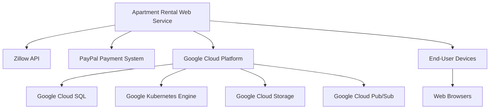
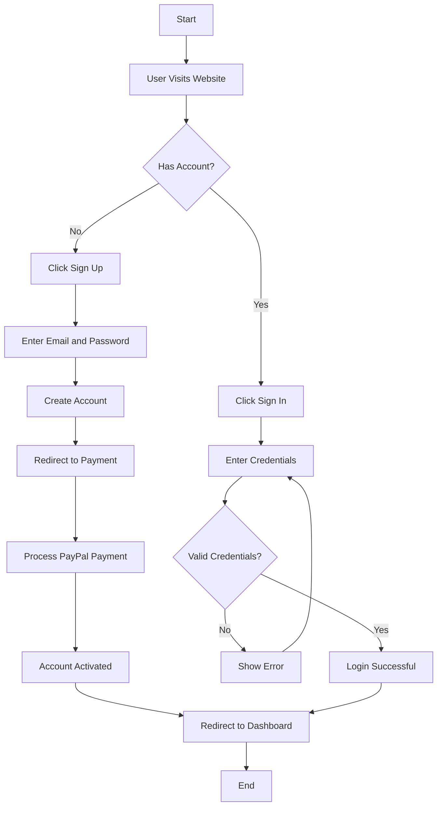
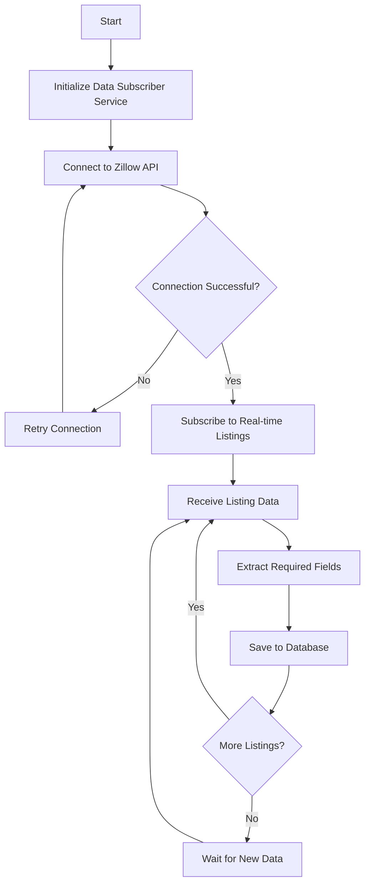
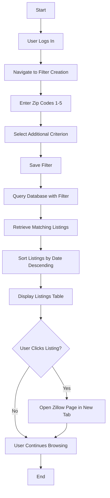
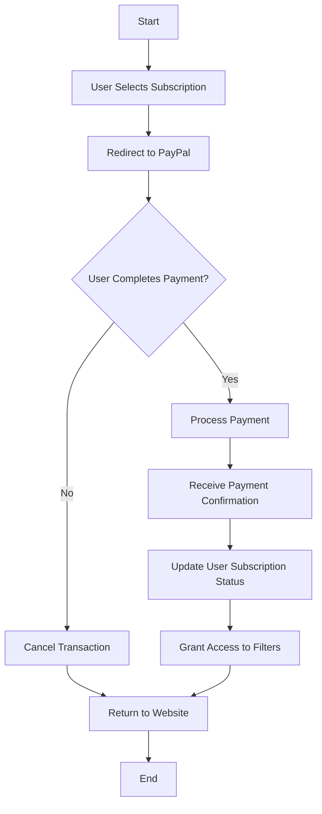
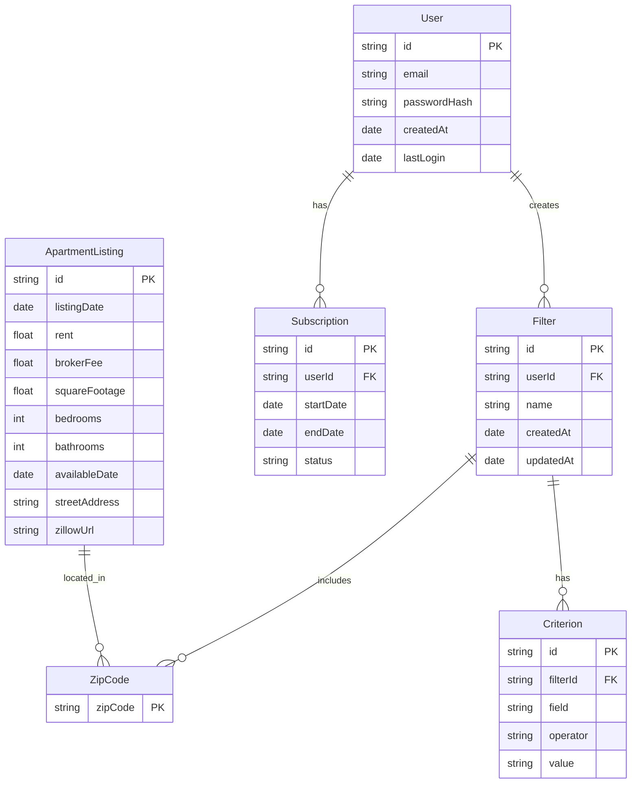
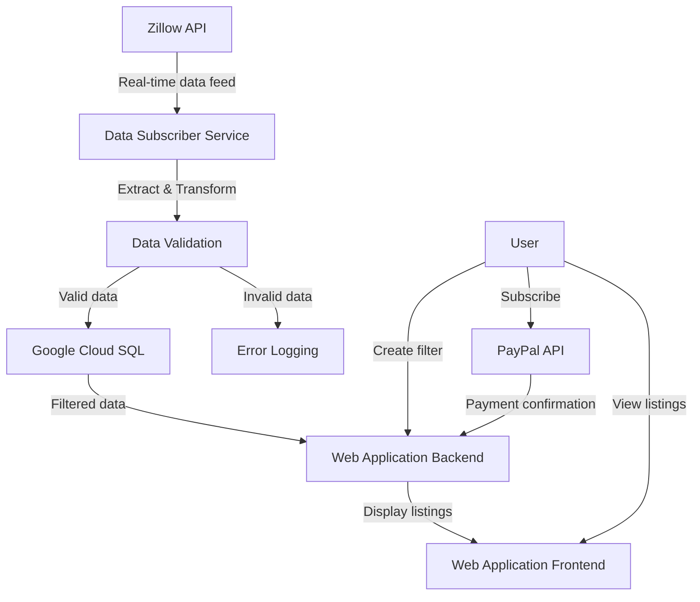
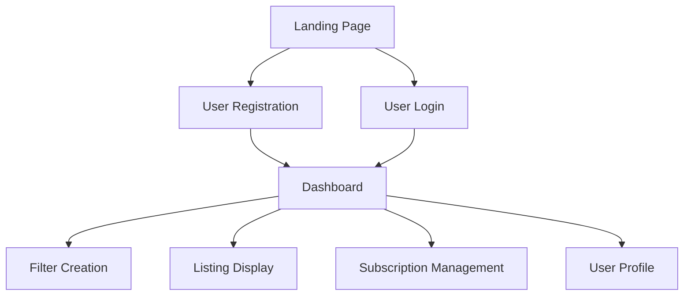

## INTRODUCTION

### PURPOSE

The purpose of this Software Requirements Specification (SRS) document is to provide a comprehensive and detailed description of the web service designed to assist recent college graduates in finding suitable apartments for rent. This document serves as a foundation for the development process, outlining the system's functionality, performance requirements, and design constraints.

This SRS is intended for the following audience:

1. Project stakeholders and decision-makers
2. Development team members (including frontend and backend developers)
3. Quality assurance and testing personnel
4. System administrators and operations staff
5. Future maintainers of the system

The document aims to establish a clear understanding of the project requirements, facilitate effective communication among team members, and serve as a reference point throughout the development lifecycle.

### SCOPE

The apartment rental web service for recent college graduates is a comprehensive platform designed to streamline the process of finding and securing rental properties. The system consists of two primary subsystems:

1. Apartment Listing Data Subscriber
2. Web Application for End-Users

#### Goals

- Provide real-time, accurate apartment listing data to users
- Simplify the apartment search process for recent college graduates
- Offer customizable filtering options to match user preferences
- Ensure a secure and user-friendly experience
- Generate revenue through a subscription-based model

#### Benefits

- Time-saving: Users can quickly find relevant listings without manual searching
- Accuracy: Real-time data ensures up-to-date and reliable information
- Customization: Personalized filters cater to individual user needs
- Accessibility: Web-based platform allows access from various devices
- Targeted: Focused on the specific needs of recent college graduates

#### Core Functionalities

1. Apartment Listing Data Subscriber:
   - Real-time data collection from Zillow's API
   - Extraction and storage of relevant listing information
   - Efficient indexing for quick data retrieval

2. Web Application:
   - User registration and authentication system
   - Custom filter creation and management
   - Display of filtered apartment listings
   - Integration with Zillow for detailed property information
   - Subscription-based access with PayPal payment processing

#### Technology Stack

- Frontend:
  - React for building the user interface
  - TypeScript for type-safe JavaScript development
  - Tailwind CSS for responsive and customizable styling

- Backend:
  - Python for server-side logic and data processing
  - FastAPI or Flask for API development

- Database:
  - Google Cloud SQL (PostgreSQL) for relational data storage

- Cloud Infrastructure:
  - Google Cloud Platform (GCP) for hosting and scalability
  - Google Kubernetes Engine (GKE) for containerized deployment
  - Google Cloud Storage for static assets

- Additional Services:
  - Google Cloud Pub/Sub for real-time data streaming
  - Google Cloud Functions for serverless operations

By leveraging this technology stack and focusing on the core functionalities, the system aims to provide a robust, scalable, and user-friendly solution for recent college graduates seeking rental apartments.

## PRODUCT DESCRIPTION

### PRODUCT PERSPECTIVE

The apartment rental web service for recent college graduates is a standalone system that integrates with external services to provide a comprehensive solution. It operates within the broader ecosystem of real estate and rental markets, specifically targeting the needs of young professionals entering the workforce. The system consists of two main subsystems:

1. Apartment Listing Data Subscriber
2. Web Application for End-Users

These subsystems interact with external services and platforms as follows:

The system leverages Zillow's API for real-time apartment listing data, integrates with PayPal for secure payment processing, and utilizes various Google Cloud Platform services for hosting, data storage, and scalability.

### PRODUCT FUNCTIONS

The apartment rental web service provides the following high-level functions:

1. Real-time Data Collection
   - Subscribe to Zillow's API to receive apartment listing updates
   - Extract and store relevant listing information in a structured format

2. User Management
   - Allow user registration and authentication
   - Manage user profiles and subscription status

3. Custom Filter Creation
   - Enable users to create and save personalized apartment search filters
   - Support filtering by location (zip codes) and one additional criterion

4. Listing Display and Interaction
   - Present filtered apartment listings in a sortable table format
   - Provide direct links to Zillow listing pages for detailed information

5. Subscription Management
   - Process subscription payments through PayPal integration
   - Control access to premium features based on subscription status

6. Data Analytics and Reporting (Basic)
   - Track user engagement and filter usage
   - Generate basic reports on popular search criteria and user activity

### USER CHARACTERISTICS

The primary users of this system are recent college graduates seeking rental apartments. The following user personas represent the target audience:

1. Tech-Savvy Graduate
   - Name: Alex Chen
   - Age: 22
   - Occupation: Entry-level Software Engineer
   - Characteristics:
     - Highly comfortable with technology
     - Values efficiency and automation in daily tasks
     - Seeks modern apartments with good internet connectivity

2. Budget-Conscious Educator
   - Name: Sarah Johnson
   - Age: 23
   - Occupation: First-year Elementary School Teacher
   - Characteristics:
     - Careful with expenses due to student loans
     - Prioritizes affordability and proximity to work
     - Appreciates user-friendly interfaces

3. Social Media Marketer
   - Name: Jordan Taylor
   - Age: 24
   - Occupation: Junior Social Media Specialist
   - Characteristics:
     - Always connected and mobile-first
     - Looks for trendy neighborhoods and Instagram-worthy spaces
     - Values quick access to information and visual appeal

User Expertise Levels:
- Basic computer and internet browsing skills required
- Familiarity with online search and filtering concepts
- No specialized knowledge of real estate or rental markets needed

### CONSTRAINTS

1. Technical Constraints
   - Zillow API limitations and rate restrictions
   - PayPal integration requirements and transaction fees
   - Google Cloud Platform service quotas and pricing tiers

2. Regulatory Constraints
   - Compliance with data protection regulations (e.g., GDPR, CCPA)
   - Adherence to fair housing laws and anti-discrimination policies
   - Compliance with Zillow's terms of service for data usage

3. Budgetary Constraints
   - Limited initial development budget of $233,640
   - Ongoing operational costs must be covered by subscription revenue

4. Time Constraints
   - Project completion deadline of 6 months from initiation to launch

5. User Interface Constraints
   - Must be responsive and functional across various devices and screen sizes
   - Accessibility requirements for users with disabilities (WCAG 2.1 compliance)

6. Performance Constraints
   - Listing display load time under 2 seconds
   - Support for at least 1000 concurrent users

7. Security Constraints
   - Implementation of secure authentication and data encryption
   - Regular security audits and vulnerability assessments required

### ASSUMPTIONS AND DEPENDENCIES

Assumptions:
1. Zillow's API will remain stable and provide accurate, up-to-date listing information
2. The target market of recent college graduates has sufficient interest in a specialized rental search service
3. Users have access to devices with modern web browsers and stable internet connections
4. The selected technology stack (React, TypeScript, Python, Google Cloud) will be suitable for the project's needs throughout its lifecycle

Dependencies:
1. Zillow API
   - Continuous access to Zillow's data feed
   - Timely updates to API documentation and support

2. PayPal Payment System
   - Reliability of PayPal's payment processing services
   - Compatibility with the project's subscription model

3. Google Cloud Platform
   - Availability and performance of selected GCP services
   - Pricing stability for budgeted cloud resources

4. Third-party Libraries and Frameworks
   - Ongoing maintenance and compatibility of key dependencies (e.g., React, FastAPI)
   - Security updates and patch availability

5. Web Browsers
   - Consistent support for modern web technologies across major browsers

6. Legal and Compliance
   - Continued compliance with relevant laws and regulations
   - Timely updates to terms of service and privacy policies

7. Development Team
   - Availability of skilled developers familiar with the chosen technology stack
   - Consistent productivity and adherence to project timelines

By carefully managing these assumptions and dependencies, the project team can mitigate risks and ensure the successful development and deployment of the apartment rental web service for recent college graduates.

## PROCESS FLOWCHART

The following flowcharts illustrate the main processes of the apartment rental web service for recent college graduates. These diagrams provide a high-level overview of the system's core functionalities and user interactions.

### User Registration and Authentication

### Apartment Listing Data Subscription

### User Filter Creation and Listing Display

### Payment Processing

These flowcharts provide a visual representation of the key processes within the apartment rental web service. They illustrate the user journey from registration and authentication to creating filters and viewing listings, as well as the backend processes for data subscription and payment processing. The development team should refer to these flowcharts when implementing the system to ensure all critical paths and decision points are accounted for in the final product.

Here's a breakdown of the product features with the requested sub-sections:

1. User Authentication and Management

ID: F001
DESCRIPTION: Implement a secure user authentication system allowing users to register, log in, and manage their accounts.
PRIORITY: High

| Functional Requirement | Description |
|------------------------|-------------|
| F001-1 | User registration with email and password |
| F001-2 | User login with email and password |
| F001-3 | Password reset functionality |
| F001-4 | User profile management (update email, password) |
| F001-5 | Session management and secure token-based authentication |

2. Apartment Listing Data Subscriber

ID: F002
DESCRIPTION: Develop a service that subscribes to Zillow's API and collects real-time apartment listing data for specified markets.
PRIORITY: High

| Functional Requirement | Description |
|------------------------|-------------|
| F002-1 | Connect to Zillow's API and handle authentication |
| F002-2 | Subscribe to real-time apartment listing updates |
| F002-3 | Extract and process required data fields from Zillow's API responses |
| F002-4 | Store processed listing data in Google Cloud SQL (PostgreSQL) |
| F002-5 | Implement error handling and retry mechanisms for API failures |

3. Custom Filter Creation

ID: F003
DESCRIPTION: Allow users to create and save custom filters for apartment listings based on specified criteria.
PRIORITY: High

| Functional Requirement | Description |
|------------------------|-------------|
| F003-1 | Interface for users to input up to 5 zip codes |
| F003-2 | Option to add one simple criterion (e.g., rent < 2000) |
| F003-3 | Save and name custom filters |
| F003-4 | Edit existing custom filters |
| F003-5 | Delete custom filters |

4. Filtered Listing Display

ID: F004
DESCRIPTION: Display apartment listings that match the user's custom filter in a sortable table format.
PRIORITY: High

| Functional Requirement | Description |
|------------------------|-------------|
| F004-1 | Retrieve filtered listings from the database |
| F004-2 | Display listings in a table format using React and Tailwind CSS |
| F004-3 | Implement sorting functionality (default: descending order by listing date) |
| F004-4 | Enable clickable rows to open Zillow listing pages in new tabs |
| F004-5 | Implement pagination or infinite scrolling for large result sets |

5. Subscription Payment Processing

ID: F005
DESCRIPTION: Integrate PayPal for processing subscription payments before users can access the filter creation feature.
PRIORITY: High

| Functional Requirement | Description |
|------------------------|-------------|
| F005-1 | Implement PayPal subscription payment flow |
| F005-2 | Handle successful payment scenarios and grant access to filter creation |
| F005-3 | Manage failed payment attempts and provide user feedback |
| F005-4 | Store and manage subscription status for users |
| F005-5 | Implement subscription renewal and cancellation processes |

6. Admin Dashboard

ID: F006
DESCRIPTION: Create an administrative dashboard for managing users, subscriptions, and system settings.
PRIORITY: Medium

| Functional Requirement | Description |
|------------------------|-------------|
| F006-1 | View and manage user accounts |
| F006-2 | Monitor subscription statuses and payment history |
| F006-3 | Configure system settings (e.g., subscription prices, API keys) |
| F006-4 | View basic analytics on user engagement and popular search criteria |
| F006-5 | Manage and update zip code coverage for the data subscriber |

7. Responsive Web Design

ID: F007
DESCRIPTION: Ensure the web application is responsive and functions well on various devices and screen sizes.
PRIORITY: Medium

| Functional Requirement | Description |
|------------------------|-------------|
| F007-1 | Implement responsive design using Tailwind CSS |
| F007-2 | Optimize layout for mobile devices |
| F007-3 | Ensure functionality across major web browsers |
| F007-4 | Implement touch-friendly interactions for mobile users |
| F007-5 | Optimize performance for slower internet connections |

8. Data Analytics and Reporting

ID: F008
DESCRIPTION: Implement basic data analytics and reporting features to track user engagement and system performance.
PRIORITY: Low

| Functional Requirement | Description |
|------------------------|-------------|
| F008-1 | Track and store user activity data |
| F008-2 | Generate reports on popular search criteria and user engagement |
| F008-3 | Monitor and report on system performance metrics |
| F008-4 | Implement data visualization for key metrics |
| F008-5 | Export reports in common formats (e.g., CSV, PDF) |

These features cover the core functionality of the apartment rental web service for recent college graduates. The implementation will use TypeScript, React, and Tailwind CSS for the frontend, Python for the backend, and leverage the Google Cloud ecosystem for hosting and data management. PayPal will be integrated for payment processing as specified in the original requirements.

## NON-FUNCTIONAL REQUIREMENTS

### PERFORMANCE

1. Response Time
   - The web application shall load initial content within 2 seconds on a standard broadband connection (10 Mbps).
   - Filtered apartment listings shall be displayed within 1 second of applying or changing filters.
   - API requests to the backend shall have a maximum response time of 500 milliseconds for 95% of requests under normal load.

2. Throughput
   - The system shall support at least 1000 concurrent users without degradation in performance.
   - The apartment listing data subscriber shall process a minimum of 1000 listings per hour from Zillow's API.

3. Resource Usage
   - The web application's frontend shall not consume more than 100MB of client-side memory.
   - The backend services shall utilize no more than 70% of allocated CPU and memory resources under normal load.
   - Database queries shall be optimized to execute within 100 milliseconds for 90% of requests.

### SAFETY

1. Data Backup
   - The system shall perform automated daily backups of all user data and apartment listings.
   - Backups shall be stored in a separate Google Cloud Storage bucket with versioning enabled.

2. Fault Tolerance
   - The system shall implement automatic failover mechanisms to ensure continuous operation in case of server failures.
   - In the event of a database failure, the system shall switch to a read-only mode to prevent data corruption.

3. Error Handling
   - The system shall log all errors and exceptions, including stack traces, in a centralized logging system.
   - User-facing error messages shall be informative but not reveal sensitive system information.

### SECURITY

1. Authentication
   - User authentication shall be implemented using JSON Web Tokens (JWT) with a maximum token lifetime of 24 hours.
   - Passwords shall be hashed using bcrypt with a minimum work factor of 10.

2. Authorization
   - Role-based access control (RBAC) shall be implemented to manage user permissions.
   - API endpoints shall be protected using middleware that verifies user authentication and authorization.

3. Data Encryption
   - All data transmitted between the client and server shall be encrypted using TLS 1.3 or higher.
   - Sensitive data stored in the database (e.g., user passwords) shall be encrypted at rest using AES-256 encryption.

4. Privacy
   - The system shall comply with GDPR and CCPA regulations for user data protection.
   - Users shall have the ability to export their personal data and request account deletion.

### QUALITY

1. Availability
   - The system shall maintain 99.9% uptime, allowing for no more than 8.76 hours of downtime per year.
   - Planned maintenance shall be scheduled during off-peak hours and communicated to users at least 48 hours in advance.

2. Maintainability
   - The codebase shall follow consistent coding standards and best practices for TypeScript, React, and Python.
   - The system shall use dependency injection and modular architecture to facilitate easy updates and maintenance.
   - Comprehensive documentation shall be maintained for all major components and APIs.

3. Usability
   - The user interface shall be responsive and functional across devices with screen sizes ranging from 320px to 2560px wide.
   - The web application shall conform to WCAG 2.1 Level AA accessibility standards.
   - The user interface shall be localized to support English and Spanish languages.

4. Scalability
   - The system architecture shall support horizontal scaling to handle increased load.
   - Database sharding shall be implemented to support growth beyond 1 million apartment listings.
   - The system shall use Google Cloud's auto-scaling features to automatically adjust resources based on demand.

5. Reliability
   - The system shall have a Mean Time Between Failures (MTBF) of at least 720 hours (30 days).
   - In the event of a failure, the Mean Time To Repair (MTTR) shall not exceed 2 hours.
   - Automated monitoring and alerting shall be implemented to detect and notify of any system anomalies.

### COMPLIANCE

1. Legal
   - The system shall comply with the Fair Housing Act and not discriminate against protected classes in apartment listings or user access.
   - Terms of Service and Privacy Policy shall be clearly displayed and require user acceptance before account creation.

2. Regulatory
   - The system shall comply with the General Data Protection Regulation (GDPR) for users in the European Union.
   - The California Consumer Privacy Act (CCPA) requirements shall be met for users in California.

3. Standards
   - The web application shall conform to the OWASP Top 10 Web Application Security Risks guidelines.
   - API design and documentation shall follow the OpenAPI (Swagger) Specification version 3.0 or higher.
   - The system shall adhere to the PCI DSS standards for handling credit card information during PayPal integration.

4. Zillow API Compliance
   - The apartment listing data subscriber shall adhere to Zillow's API terms of service and rate limiting requirements.
   - All data retrieved from Zillow's API shall be properly attributed as per their attribution guidelines.

5. Accessibility
   - The web application shall comply with Section 508 of the Rehabilitation Act for accessibility.
   - An accessibility statement shall be provided, detailing the level of conformance and any known limitations.

These non-functional requirements provide a comprehensive framework for ensuring the apartment rental web service meets performance, safety, security, quality, and compliance standards. They align with the previously specified technology stack, including TypeScript, React, and Tailwind CSS for the frontend, Python for the backend, and Google Cloud services for infrastructure and scalability.

## DATA REQUIREMENTS

### DATA MODELS

The apartment rental web service will use the following data models to represent the core entities in the system:

This entity-relationship diagram illustrates the relationships between the main data models in the system. The `ApartmentListing` entity represents the data collected from Zillow's API, while the `User`, `Filter`, `ZipCode`, `Criterion`, and `Subscription` entities support the web application's functionality.

### DATA STORAGE

The apartment rental web service will use Google Cloud SQL with PostgreSQL as the primary relational database for storing structured data. This choice aligns with the Google Cloud ecosystem and provides robust support for complex queries and indexing required by the application.

1. Data Retention:
   - Apartment listings will be retained for 6 months after their available date has passed.
   - User data, including filters and subscriptions, will be retained for the lifetime of the account plus 30 days after account deletion.
   - Anonymized usage data for analytics purposes will be retained for 2 years.

2. Redundancy:
   - Google Cloud SQL will be configured with regional availability to ensure high availability and redundancy.
   - Read replicas will be set up in different zones within the same region to distribute read traffic and provide failover capabilities.

3. Backup:
   - Automated daily backups of the entire database will be configured using Google Cloud SQL's built-in backup feature.
   - Point-in-time recovery will be enabled to allow for granular recovery options.
   - Weekly full backups will be exported to Google Cloud Storage for long-term retention and additional redundancy.

4. Recovery:
   - A disaster recovery plan will be implemented with the following Recovery Time Objective (RTO) and Recovery Point Objective (RPO):
     - RTO: 1 hour
     - RPO: 5 minutes
   - Automated failover will be configured between the primary instance and read replicas to minimize downtime in case of instance failure.
   - Regular disaster recovery drills will be conducted to ensure the effectiveness of the recovery process.

5. Scaling:
   - Vertical scaling: Google Cloud SQL instances will be sized appropriately and can be easily upgraded as the data volume grows.
   - Horizontal scaling: Read replicas will be added to distribute read traffic as the user base expands.
   - Sharding: If data volume exceeds the capabilities of a single instance, the database will be sharded based on geographical regions or date ranges of apartment listings.

### DATA PROCESSING

The apartment rental web service will process data through several stages, ensuring security and efficiency throughout the pipeline. The following data flow diagram illustrates the main data processing steps:

Data Security:

1. Data in Transit:
   - All communication between components will use TLS 1.3 encryption.
   - API endpoints will be secured using OAuth 2.0 for authentication and authorization.

2. Data at Rest:
   - Google Cloud SQL databases will be encrypted using Google-managed encryption keys.
   - Sensitive data fields (e.g., user passwords) will be hashed using bcrypt before storage.

3. Access Control:
   - Principle of least privilege will be applied to all service accounts and IAM roles.
   - Database access will be restricted to specific IP ranges and use strong authentication.

4. Data Masking:
   - Personal Identifiable Information (PII) will be masked in non-production environments.

5. Audit Logging:
   - All data access and modifications will be logged using Google Cloud Audit Logs.

6. Compliance:
   - Data processing will adhere to GDPR and CCPA requirements for user data protection.

7. Secure Development Practices:
   - Regular security code reviews and penetration testing will be conducted.
   - Dependencies will be regularly updated to patch known vulnerabilities.

Data Processing Steps:

1. Data Ingestion:
   - The Data Subscriber Service will connect to Zillow's API using secure authentication.
   - Real-time apartment listing data will be ingested and temporarily stored in memory.

2. Data Validation and Transformation:
   - Incoming data will be validated for completeness and correctness.
   - Data will be transformed to match the `ApartmentListing` schema.
   - Invalid data will be logged for further investigation.

3. Data Storage:
   - Validated and transformed data will be stored in Google Cloud SQL.
   - Indexes will be created on frequently queried fields for performance optimization.

4. Data Retrieval:
   - The Web Application Backend will query the database based on user filters.
   - Query results will be paginated to optimize performance for large result sets.

5. Data Presentation:
   - The Web Application Frontend will receive filtered data and render it using React components.
   - Tailwind CSS will be used for responsive and efficient styling of the data presentation.

6. User Data Processing:
   - User registration and authentication data will be securely processed and stored.
   - User-created filters will be associated with user accounts and stored in the database.

7. Payment Processing:
   - Subscription payments will be securely processed through PayPal's API.
   - Payment confirmations will update user subscription status in the database.

By implementing these data requirements, the apartment rental web service will ensure secure, efficient, and scalable data processing throughout the system, from data ingestion to presentation to the end-user.

## EXTERNAL INTERFACES

### USER INTERFACES

The apartment rental web service will provide a user-friendly interface designed using React and Tailwind CSS. The interface will be responsive, ensuring a consistent experience across desktop and mobile devices. Key user interface components include:

1. User Registration and Login
   - Clean, minimalist forms for user registration and login
   - Password strength indicator and validation feedback

2. Dashboard
   - Overview of saved filters and subscription status
   - Quick access to create new filters or view existing ones

3. Filter Creation Interface
   - Intuitive form for entering zip codes and additional criteria
   - Real-time validation and feedback on filter inputs

4. Listing Display
   - Sortable table view of apartment listings matching the user's filter
   - Responsive design to accommodate various screen sizes
   - Clear call-to-action for opening Zillow listing pages

5. Subscription Management
   - Simple interface for viewing and managing subscription status
   - Seamless integration with PayPal for payment processing

6. User Profile
   - Form for updating user information and preferences

Placeholder for UI mockups:
[Insert wireframes or mockups for key interface components here]

### SOFTWARE INTERFACES

The apartment rental web service will interact with several external software systems:

1. Zillow API
   - Purpose: Retrieve real-time apartment listing data
   - Interface Type: RESTful API
   - Data Format: JSON
   - Communication Protocol: HTTPS
   - Authentication: API key or OAuth 2.0 (as per Zillow's requirements)
   - Rate Limiting: Adhere to Zillow's rate limiting policies

2. PayPal API
   - Purpose: Process subscription payments
   - Interface Type: RESTful API
   - Data Format: JSON
   - Communication Protocol: HTTPS
   - Authentication: OAuth 2.0
   - Sandbox Environment: Available for testing

3. Google Cloud SQL
   - Purpose: Store and retrieve application data
   - Interface Type: SQL
   - Data Format: Relational tables
   - Communication Protocol: Secure TCP connection
   - Authentication: SSL/TLS certificates, IAM authentication

4. Google Cloud Storage
   - Purpose: Store static assets and backups
   - Interface Type: RESTful API
   - Data Format: Binary (for files), JSON (for metadata)
   - Communication Protocol: HTTPS
   - Authentication: Service account credentials

5. Google Cloud Pub/Sub
   - Purpose: Handle real-time data streaming and event-driven architecture
   - Interface Type: gRPC API
   - Data Format: Protocol Buffers
   - Communication Protocol: HTTPS
   - Authentication: Service account credentials

### COMMUNICATION INTERFACES

The apartment rental web service will utilize the following communication interfaces:

1. HTTPS
   - Purpose: Secure communication between client browsers and the web server
   - Protocol: TLS 1.3 or higher
   - Port: 443
   - Data Format: HTML, CSS, JavaScript, JSON

2. WebSocket
   - Purpose: Real-time updates for apartment listings (if implemented)
   - Protocol: WSS (WebSocket Secure)
   - Port: 443
   - Data Format: JSON

3. Database Connection
   - Purpose: Communication between the application server and Google Cloud SQL
   - Protocol: PostgreSQL wire protocol over SSL
   - Port: 5432 (default, can be configured)
   - Data Format: SQL queries and results

4. Internal API
   - Purpose: Communication between frontend and backend services
   - Protocol: HTTPS
   - Port: 443
   - Data Format: JSON
   - Authentication: JWT (JSON Web Tokens)

5. Email Communication
   - Purpose: User notifications, password resets, etc.
   - Protocol: SMTP
   - Port: 587 (TLS) or 465 (SSL)
   - Data Format: MIME

6. Logging and Monitoring
   - Purpose: Application logging and performance monitoring
   - Protocol: HTTPS
   - Port: 443
   - Data Format: Structured logging (JSON)
   - Service: Google Cloud Logging and Monitoring

These communication interfaces ensure secure and efficient data exchange between various components of the system, external services, and end-users. All communications will be encrypted using industry-standard protocols to maintain data privacy and integrity.

## APPENDICES

### GLOSSARY

- API (Application Programming Interface): A set of protocols and tools for building software applications.
- Broker Fee: A fee charged by real estate brokers for their services in facilitating a rental agreement.
- Filter: A set of criteria used to narrow down apartment listings based on user preferences.
- Listing: An advertisement for an apartment available for rent.
- Relational Database: A type of database that stores and provides access to data points that are related to one another.
- Subscription: A recurring payment model that grants users access to the web service.
- Zip Code: A postal code used to identify specific geographic regions.

### ACRONYMS

- CCPA: California Consumer Privacy Act
- CSS: Cascading Style Sheets
- GDPR: General Data Protection Regulation
- GKE: Google Kubernetes Engine
- IAM: Identity and Access Management
- IDE: Integrated Development Environment
- JWT: JSON Web Token
- MIME: Multipurpose Internet Mail Extensions
- PCI DSS: Payment Card Industry Data Security Standard
- QA: Quality Assurance
- RBAC: Role-Based Access Control
- REST: Representational State Transfer
- SRS: Software Requirements Specification
- SSL: Secure Sockets Layer
- TLS: Transport Layer Security
- UAT: User Acceptance Testing
- UI/UX: User Interface/User Experience
- WCAG: Web Content Accessibility Guidelines
- XSS: Cross-Site Scripting

### ADDITIONAL REFERENCES

1. React Documentation: https://reactjs.org/docs/getting-started.html
2. TypeScript Handbook: https://www.typescriptlang.org/docs/
3. Tailwind CSS Documentation: https://tailwindcss.com/docs
4. Python Official Documentation: https://docs.python.org/3/
5. Google Cloud Documentation: https://cloud.google.com/docs
6. PostgreSQL Documentation: https://www.postgresql.org/docs/
7. PayPal Developer Documentation: https://developer.paypal.com/docs/
8. Zillow API Documentation: https://www.zillow.com/howto/api/APIOverview.htm
9. OWASP Top Ten Web Application Security Risks: https://owasp.org/www-project-top-ten/
10. GDPR Official Text: https://gdpr-info.eu/
11. CCPA Official Text: https://oag.ca.gov/privacy/ccpa
12. Web Accessibility Initiative (WAI) Guidelines: https://www.w3.org/WAI/standards-guidelines/
13. JSON Web Token (JWT) Introduction: https://jwt.io/introduction/
14. RESTful API Design Best Practices: https://restfulapi.net/
15. Google Cloud SQL for PostgreSQL: https://cloud.google.com/sql/docs/postgres
16. Google Kubernetes Engine (GKE) Documentation: https://cloud.google.com/kubernetes-engine/docs
17. Google Cloud Pub/Sub Documentation: https://cloud.google.com/pubsub/docs
18. Google Cloud Storage Documentation: https://cloud.google.com/storage/docs
19. Google Cloud Functions Documentation: https://cloud.google.com/functions/docs
20. Bcrypt Documentation: https://github.com/kelektiv/node.bcrypt.js#readme

These additional references provide in-depth information on the technologies, standards, and best practices relevant to the development of the apartment rental web service for recent college graduates. They serve as valuable resources for the development team throughout the project lifecycle.