## INTRODUCTION

### SYSTEM OVERVIEW

The apartment rental web service for recent college graduates is a comprehensive platform designed to streamline the process of finding and securing rental properties. The system consists of two primary subsystems working in tandem to provide a seamless user experience:

1. Apartment Listing Data Subscriber
2. Web Application for End-Users

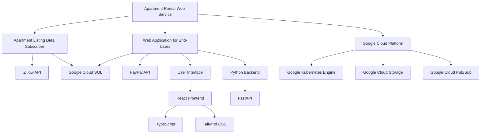

#### Apartment Listing Data Subscriber

This subsystem is responsible for continuously fetching and processing real-time apartment listing data from Zillow's API. Key features include:

- Real-time data ingestion from Zillow's API
- Data extraction and transformation
- Storage of processed data in Google Cloud SQL (PostgreSQL)
- Efficient indexing for quick data retrieval

#### Web Application for End-Users

The web application provides a user-friendly interface for recent college graduates to search for and interact with apartment listings. Key features include:

- User registration and authentication
- Custom filter creation and management
- Display of filtered apartment listings
- Integration with Zillow for detailed property information
- Subscription-based access with PayPal payment processing

#### Technology Stack

The system leverages modern technologies to ensure scalability, performance, and maintainability:

| Component | Technology |
|-----------|------------|
| Frontend | React, TypeScript, Tailwind CSS |
| Backend | Python, FastAPI |
| Database | Google Cloud SQL (PostgreSQL) |
| Cloud Infrastructure | Google Cloud Platform (GCP) |
| Container Orchestration | Google Kubernetes Engine (GKE) |
| Static Asset Storage | Google Cloud Storage |
| Message Queue | Google Cloud Pub/Sub |
| Payment Processing | PayPal API |

#### Key System Interactions

1. The Apartment Listing Data Subscriber continuously fetches data from Zillow's API and stores it in Google Cloud SQL.
2. Users interact with the Web Application through a responsive React frontend.
3. The Python backend processes user requests, queries the database, and returns filtered results.
4. User authentication and authorization are handled securely using JWT tokens.
5. Subscription payments are processed through PayPal integration.
6. The entire system is deployed on Google Kubernetes Engine for scalability and ease of management.

This system overview provides a high-level understanding of the apartment rental web service's architecture and key components. The following sections will delve into more detailed aspects of the system's functionality, data flow, and technical specifications.

## SYSTEM ARCHITECTURE

### PROGRAMMING LANGUAGES

The apartment rental web service will utilize the following programming languages:

1. TypeScript
   - Used for: Frontend development (React components, state management)
   - Justification: Provides static typing, enhancing code quality and maintainability in complex frontend applications

2. JavaScript
   - Used for: Frontend development (supporting libraries, build tools)
   - Justification: Necessary for certain npm packages and build processes

3. Python
   - Used for: Backend development (API, data processing, integration with external services)
   - Justification: Versatile, readable, and well-suited for data processing tasks and API development

4. SQL
   - Used for: Database queries and management
   - Justification: Standard language for interacting with relational databases (Google Cloud SQL with PostgreSQL)

5. HTML5
   - Used for: Structuring web content
   - Justification: Standard markup language for web pages

6. CSS3 (via Tailwind CSS)
   - Used for: Styling web content
   - Justification: Tailwind CSS provides a utility-first approach, enabling rapid UI development

| Language   | Primary Use Case        | Justification                                            |
|------------|-------------------------|----------------------------------------------------------|
| TypeScript | Frontend (React)        | Static typing, improved maintainability                  |
| JavaScript | Frontend (Support)      | Compatibility with certain libraries and build tools     |
| Python     | Backend                 | Versatility, readability, strong data processing capabilities |
| SQL        | Database Management     | Standard for relational database interactions            |
| HTML5      | Web Content Structure   | Industry standard for web markup                         |
| CSS3       | Styling (Tailwind CSS)  | Rapid UI development with utility-first approach         |

### HIGH-LEVEL ARCHITECTURE DIAGRAM

The following diagram provides an overview of the system's components and their interactions:

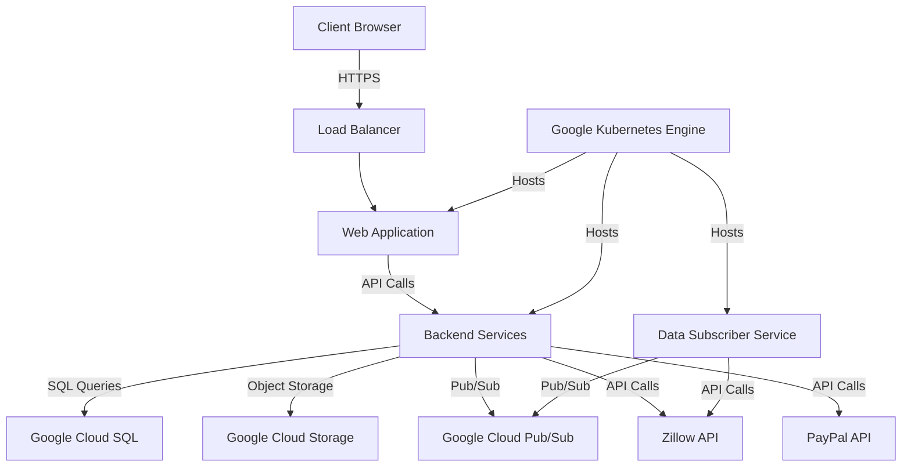

This high-level architecture diagram illustrates the main components of the apartment rental web service and their interactions. The system leverages Google Cloud Platform services for hosting, storage, and messaging, while integrating with external APIs for real-time data and payment processing.

### COMPONENT DIAGRAMS

The following component diagram details the specific modules within the system and their relationships:

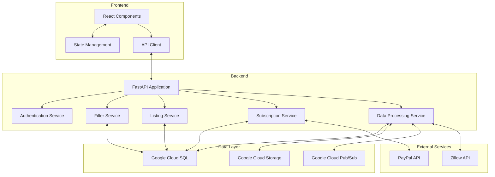

This component diagram shows the relationships between different modules in the frontend, backend, data layer, and external services. It illustrates how data flows between components and how different services interact with each other.

### SEQUENCE DIAGRAMS

The following sequence diagrams illustrate key interactions within the system:

1. User Registration and Filter Creation

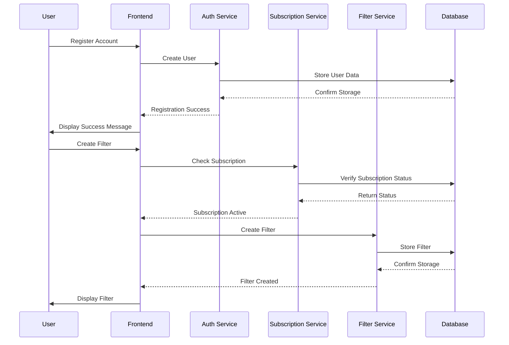

2. Apartment Listing Retrieval and Display

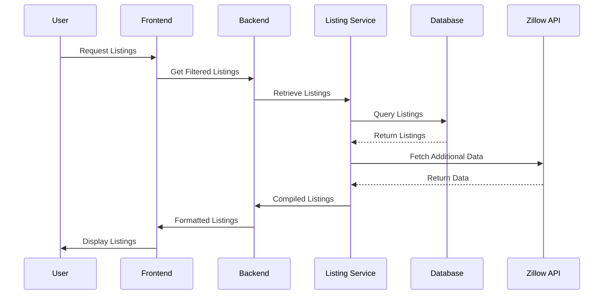

These sequence diagrams demonstrate the flow of data and control in key user scenarios, highlighting the interactions between different system components.

### DATA-FLOW DIAGRAM

The following data-flow diagram explains how information moves through the system:

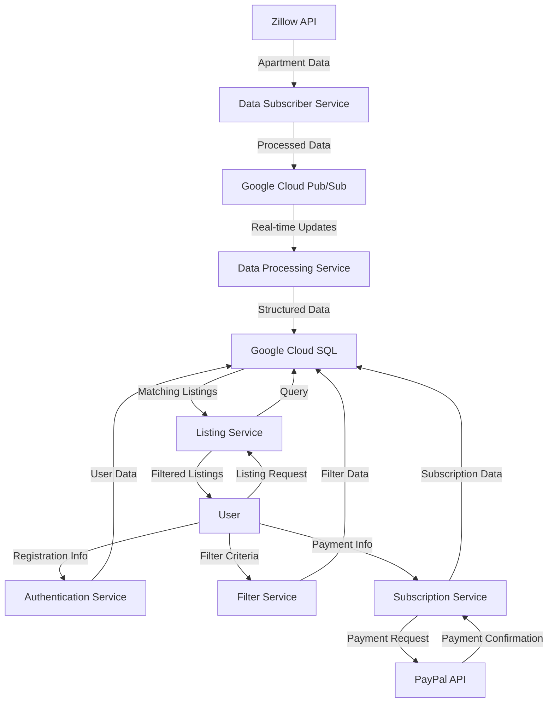

This data-flow diagram illustrates how information moves through various components of the apartment rental web service. It shows the flow of data from external sources (Zillow API, PayPal API) through the system's services and storage, and ultimately to the end-user. The diagram highlights the central role of Google Cloud SQL in storing and providing data to different services, as well as the use of Google Cloud Pub/Sub for real-time data updates.

## SYSTEM DESIGN

### PROGRAMMING LANGUAGES

The apartment rental web service will utilize the following programming languages:

1. TypeScript
   - Used for: Frontend development (React components, state management)
   - Justification: Provides static typing, enhancing code quality and maintainability in complex frontend applications

2. JavaScript
   - Used for: Frontend development (supporting libraries, build tools)
   - Justification: Necessary for certain npm packages and build processes

3. Python
   - Used for: Backend development (API, data processing, integration with external services)
   - Justification: Versatile, readable, and well-suited for data processing tasks and API development

4. SQL
   - Used for: Database queries and management
   - Justification: Standard language for interacting with relational databases (Google Cloud SQL with PostgreSQL)

5. HTML5
   - Used for: Structuring web content
   - Justification: Standard markup language for web pages

6. CSS3 (via Tailwind CSS)
   - Used for: Styling web content
   - Justification: Tailwind CSS provides a utility-first approach, enabling rapid UI development

| Language   | Primary Use Case        | Justification                                            |
|------------|-------------------------|----------------------------------------------------------|
| TypeScript | Frontend (React)        | Static typing, improved maintainability                  |
| JavaScript | Frontend (Support)      | Compatibility with certain libraries and build tools     |
| Python     | Backend                 | Versatility, readability, strong data processing capabilities |
| SQL        | Database Management     | Standard for relational database interactions            |
| HTML5      | Web Content Structure   | Industry standard for web markup                         |
| CSS3       | Styling (Tailwind CSS)  | Rapid UI development with utility-first approach         |

### DATABASE DESIGN

The apartment rental web service will use Google Cloud SQL with PostgreSQL as the primary database. The database schema is designed to support the core functionalities of the application:

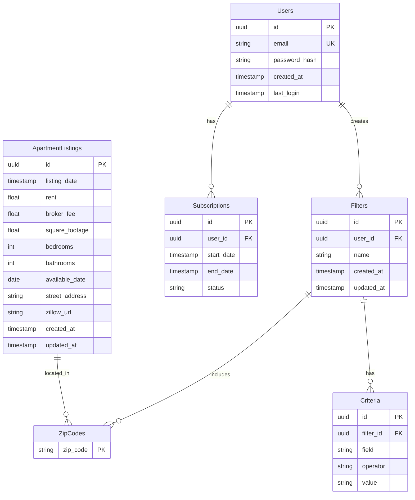

Key considerations for the database design:

1. Use of UUIDs as primary keys for better distribution and scalability
2. Indexing on frequently queried fields (e.g., zip_code, rent, bedrooms)
3. Timestamp fields for tracking creation and updates
4. Separate tables for filters and criteria to allow for flexible filtering options
5. Many-to-many relationship between Filters and ZipCodes to support multiple zip code selection

### API DESIGN

The apartment rental web service will use a RESTful API design for communication between the frontend and backend, as well as for integrating with external services. The API will be implemented using FastAPI in Python.

1. Authentication Endpoints:

```
POST /api/auth/register
POST /api/auth/login
POST /api/auth/refresh
POST /api/auth/logout
```

2. User Management Endpoints:

```
GET /api/users/me
PUT /api/users/me
DELETE /api/users/me
```

3. Filter Management Endpoints:

```
GET /api/filters
POST /api/filters
GET /api/filters/{filter_id}
PUT /api/filters/{filter_id}
DELETE /api/filters/{filter_id}
```

4. Apartment Listing Endpoints:

```
GET /api/listings
GET /api/listings/{listing_id}
```

5. Subscription Management Endpoints:

```
GET /api/subscriptions
POST /api/subscriptions
GET /api/subscriptions/{subscription_id}
PUT /api/subscriptions/{subscription_id}
DELETE /api/subscriptions/{subscription_id}
```

6. Payment Integration Endpoint:

```
POST /api/payments/process
```

API Design Considerations:

1. Use of HTTPS for all communications
2. JWT-based authentication for securing endpoints
3. Versioning (e.g., /api/v1/) to allow for future API changes
4. Consistent error handling and response formats
5. Rate limiting to prevent abuse
6. Pagination for listing results
7. CORS configuration for security

### USER INTERFACE DESIGN

The user interface will be built using React with TypeScript and styled using Tailwind CSS. The design will focus on simplicity, usability, and responsiveness across devices.

1. Landing Page:

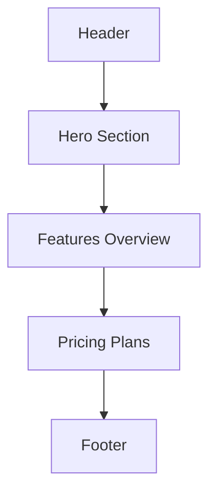

2. User Dashboard:

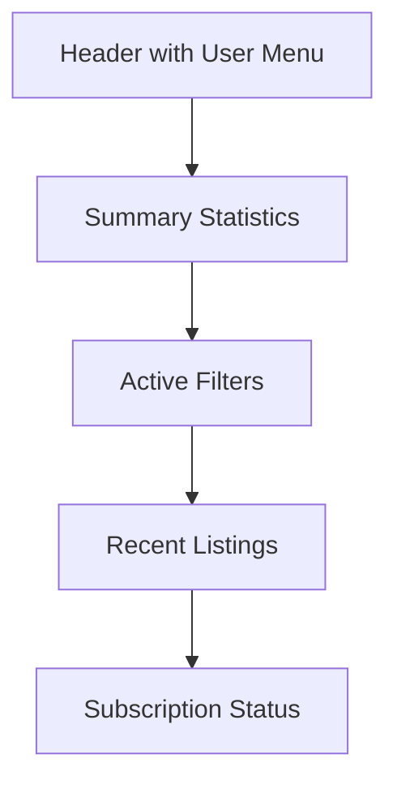

3. Filter Creation/Edit Page:

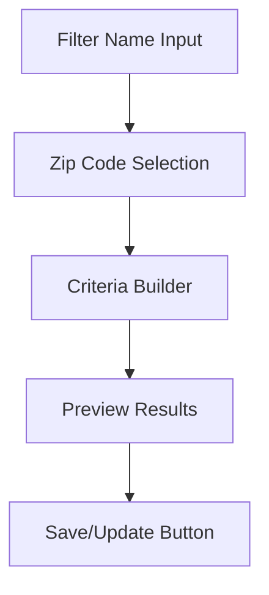

4. Listing Results Page:

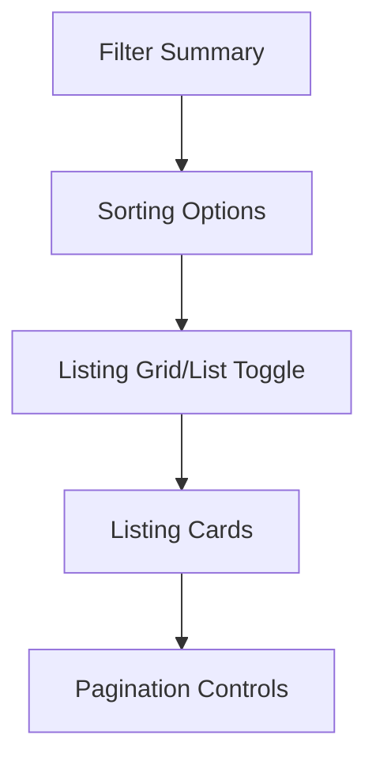

5. Listing Detail Modal:

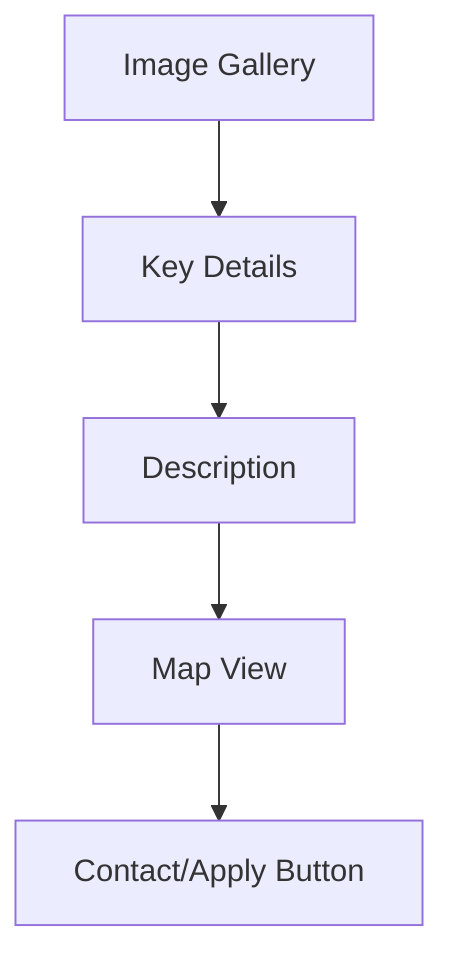

UI Design Considerations:

1. Responsive design using Tailwind CSS breakpoints
2. Accessible color scheme and contrast ratios
3. Intuitive navigation with clear call-to-action buttons
4. Skeleton loading states for improved perceived performance
5. Error handling and user feedback messages
6. Modular component design for reusability
7. Dark mode support using Tailwind CSS

The user interface will be implemented using functional React components with hooks for state management. TypeScript will be used to ensure type safety and improve developer productivity. Tailwind CSS utility classes will be leveraged for consistent styling and rapid development.

This system design outlines the key technical decisions and structures for the apartment rental web service, focusing on modern, scalable technologies that align with the project requirements and the Google Cloud ecosystem.

## TECHNOLOGY STACK

### PROGRAMMING LANGUAGES

The apartment rental web service will utilize the following programming languages:

| Language   | Purpose                                   | Justification                                                                                |
|------------|-------------------------------------------|----------------------------------------------------------------------------------------------|
| TypeScript | Frontend development                      | Static typing, enhanced tooling, improved maintainability for complex React applications     |
| Python     | Backend development, data processing      | Versatility, extensive libraries, strong data processing capabilities, FastAPI compatibility |
| SQL        | Database queries                          | Standard language for interacting with relational databases (Google Cloud SQL)               |
| HTML5      | Markup for web pages                      | Latest standard for structuring web content                                                  |
| CSS3       | Styling (via Tailwind CSS)                | Modern styling capabilities, seamless integration with Tailwind CSS                          |

### FRAMEWORKS AND LIBRARIES

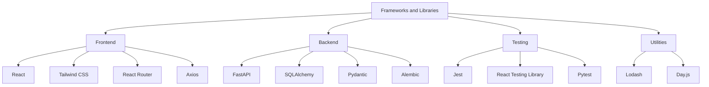

Justifications:
- React: Popular, component-based library for building interactive UIs
- Tailwind CSS: Utility-first CSS framework for rapid UI development
- FastAPI: High-performance Python web framework with automatic API documentation
- SQLAlchemy: Powerful ORM for database interactions
- Jest and Pytest: Robust testing frameworks for frontend and backend respectively

### DATABASES

The apartment rental web service will use the following database systems:

| Database Type        | Technology                | Purpose                                           |
|----------------------|---------------------------|---------------------------------------------------|
| Relational Database  | Google Cloud SQL (PostgreSQL) | Primary data storage for structured data          |
| In-Memory Cache      | Redis                     | Caching frequently accessed data for performance  |
| Object Storage       | Google Cloud Storage      | Storing static assets and large binary files      |

Justification:
- Google Cloud SQL (PostgreSQL): Scalable, managed relational database service with strong consistency and ACID compliance
- Redis: High-performance, in-memory data store for caching and real-time data processing
- Google Cloud Storage: Scalable object storage for static assets and backups

### THIRD-PARTY SERVICES

The system will integrate with the following external services:

1. Zillow API
   - Purpose: Retrieve real-time apartment listing data
   - Integration: RESTful API calls from the backend

2. PayPal API
   - Purpose: Process subscription payments
   - Integration: Server-side integration for payment processing

3. Google Cloud Services
   - Google Kubernetes Engine (GKE)
     - Purpose: Container orchestration and deployment
   - Google Cloud Pub/Sub
     - Purpose: Manage real-time data streaming and event-driven architecture
   - Google Cloud Logging
     - Purpose: Centralized logging and monitoring

4. SendGrid
   - Purpose: Transactional email service for user notifications
   - Integration: API integration for sending emails

5. Google Maps API
   - Purpose: Display apartment locations and provide geocoding services
   - Integration: Client-side integration for map rendering

6. reCAPTCHA
   - Purpose: Protect forms from spam and abuse
   - Integration: Client-side integration on registration and login forms

This technology stack leverages modern, scalable technologies that align with the project requirements and the Google Cloud ecosystem. The combination of TypeScript and React for the frontend, Python and FastAPI for the backend, and Google Cloud services for infrastructure provides a robust foundation for building a high-performance, maintainable apartment rental web service.

## SECURITY CONSIDERATIONS

### AUTHENTICATION AND AUTHORIZATION

The apartment rental web service will implement a robust authentication and authorization system to ensure secure access to user accounts and protected resources.

#### Authentication

1. JSON Web Tokens (JWT)
   - The system will use JWTs for stateless authentication.
   - JWTs will be issued upon successful login and included in subsequent API requests.
   - Token expiration will be set to 1 hour to minimize the risk of token theft.

2. Multi-Factor Authentication (MFA)
   - Optional MFA will be available for users who want enhanced account security.
   - MFA will be implemented using Time-based One-Time Passwords (TOTP).

3. Password Policy
   - Minimum password length: 12 characters
   - Required complexity: At least one uppercase letter, one lowercase letter, one number, and one special character
   - Password hashing: bcrypt with a work factor of 12

4. Account Lockout
   - Accounts will be temporarily locked after 5 failed login attempts within a 15-minute window.
   - Lockout duration: 30 minutes

#### Authorization

1. Role-Based Access Control (RBAC)
   - The system will implement RBAC with the following roles:
     - User: Standard user with access to their own data and listings
     - Admin: Full access to system features and user management
     - Support: Limited access to user data for customer support purposes

2. Attribute-Based Access Control (ABAC)
   - ABAC will be used in conjunction with RBAC to provide fine-grained access control.
   - Attributes such as subscription status and user location will be considered for access decisions.

3. API Authorization
   - All API endpoints will require a valid JWT for access.
   - The backend will validate the JWT and check the user's role and attributes for each request.

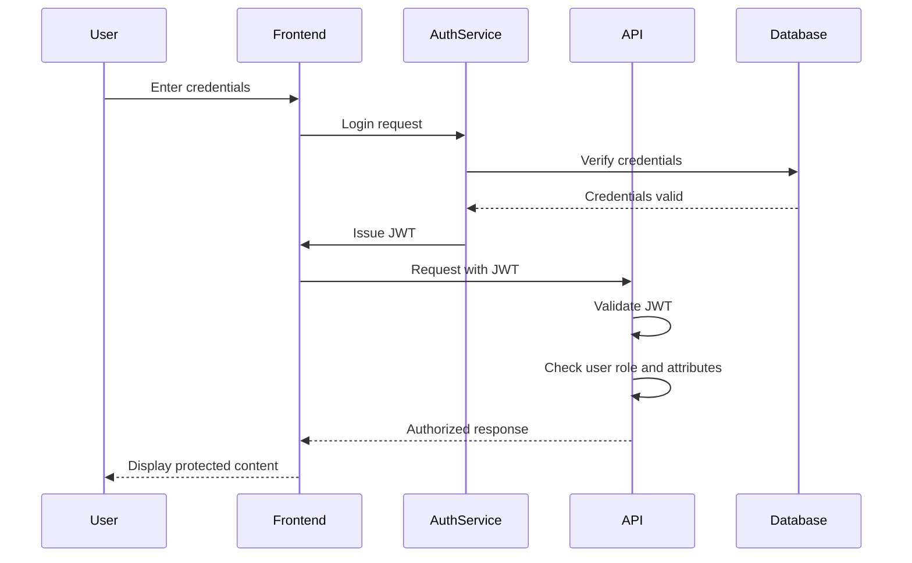

### DATA SECURITY

The apartment rental web service will implement multiple layers of data security to protect sensitive user information and maintain data integrity.

1. Encryption at Rest
   - All data stored in Google Cloud SQL will be encrypted using Google-managed encryption keys.
   - Sensitive data fields (e.g., user passwords) will be hashed using bcrypt before storage.

2. Encryption in Transit
   - All communication between the client and server will use TLS 1.3 or higher.
   - Internal communication between services will also be encrypted using TLS.

3. Data Masking
   - Personal Identifiable Information (PII) will be masked in non-production environments.
   - Logging and error reporting will exclude sensitive data.

4. Data Access Controls
   - Database access will be restricted to specific IP ranges and use strong authentication.
   - Principle of least privilege will be applied to all service accounts and IAM roles.

5. Data Backup and Recovery
   - Regular automated backups of the database will be performed.
   - Backups will be encrypted and stored in a separate Google Cloud Storage bucket.
   - A disaster recovery plan will be implemented with defined RPO and RTO.

6. Secure Data Deletion
   - User data will be securely deleted upon account closure, using industry-standard data wiping techniques.
   - Retention policies will be implemented to automatically remove unnecessary data.

| Data Type | Encryption at Rest | Encryption in Transit | Access Control | Backup Frequency |
|-----------|--------------------|-----------------------|----------------|------------------|
| User Credentials | Bcrypt hashing | TLS 1.3 | IAM + IP whitelist | Daily |
| Personal Information | AES-256 | TLS 1.3 | RBAC + ABAC | Daily |
| Apartment Listings | AES-256 | TLS 1.3 | RBAC | Daily |
| Payment Information | Tokenization (PayPal) | TLS 1.3 | PCI DSS Compliance | N/A (not stored) |

### SECURITY PROTOCOLS

The apartment rental web service will adhere to industry-standard security protocols and best practices to maintain a robust security posture.

1. Secure Development Lifecycle (SDL)
   - Implementation of security checks at each stage of the development process.
   - Regular security training for development team members.
   - Use of static code analysis tools to identify potential vulnerabilities.

2. Vulnerability Management
   - Regular vulnerability scans of the application and infrastructure.
   - Timely application of security patches and updates.
   - Participation in a responsible disclosure program for external security researchers.

3. Incident Response Plan
   - Development and maintenance of a comprehensive incident response plan.
   - Regular testing of the incident response plan through tabletop exercises.
   - Clear communication channels and escalation procedures for security incidents.

4. Compliance and Auditing
   - Regular internal security audits.
   - Annual third-party penetration testing.
   - Compliance with relevant standards (e.g., OWASP Top 10, GDPR, CCPA).

5. Monitoring and Logging
   - Implementation of centralized logging using Google Cloud Logging.
   - Real-time monitoring of security events and anomalies.
   - Use of Google Cloud Security Command Center for threat detection and security analytics.

6. Access Control and Management
   - Implementation of strong authentication mechanisms for all system access.
   - Regular review and audit of user access rights.
   - Secure and automated process for provisioning and deprovisioning user accounts.

7. Third-Party Risk Management
   - Security assessment of all third-party integrations (e.g., Zillow API, PayPal).
   - Regular review of third-party security practices and compliance.
   - Contractual agreements with third-party providers to maintain security standards.

```mermaid
graph TD
    A[Security Protocols] --> B[Secure Development Lifecycle]
    A --> C[Vulnerability Management]
    A --> D[Incident Response Plan]
    A --> E[Compliance and Auditing]
    A --> F[Monitoring and Logging]
    A --> G[Access Control and Management]
    A --> H[Third-Party Risk Management]

    B --> I[Security Training]
    B --> J[Code Analysis]
    B --> K[Security Reviews]

    C --> L[Regular Scans]
    C --> M[Patch Management]
    C --> N[Disclosure Program]

    D --> O[Response Plan]
    D --> P[Tabletop Exercises]
    D --> Q[Communication Procedures]

    E --> R[Internal Audits]
    E --> S[Penetration Testing]
    E --> T[Compliance Checks]

    F --> U[Centralized Logging]
    F --> V[Real-time Monitoring]
    F --> W[Security Analytics]

    G --> X[Strong Authentication]
    G --> Y[Access Reviews]
    G --> Z[Account Management]

    H --> AA[Vendor Assessment]
    H --> AB[Regular Reviews]
    H --> AC[Contractual Agreements]
```

These security protocols ensure a comprehensive approach to maintaining the security of the apartment rental web service. By implementing these measures, the system will be well-protected against potential threats and vulnerabilities, while also ensuring compliance with relevant regulations and industry standards.